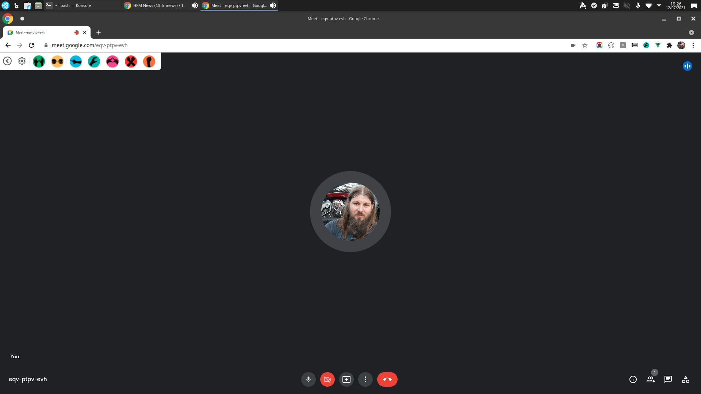
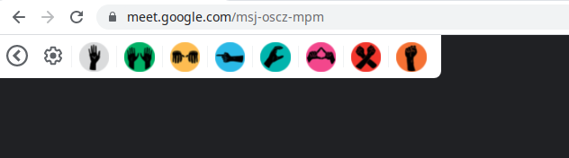
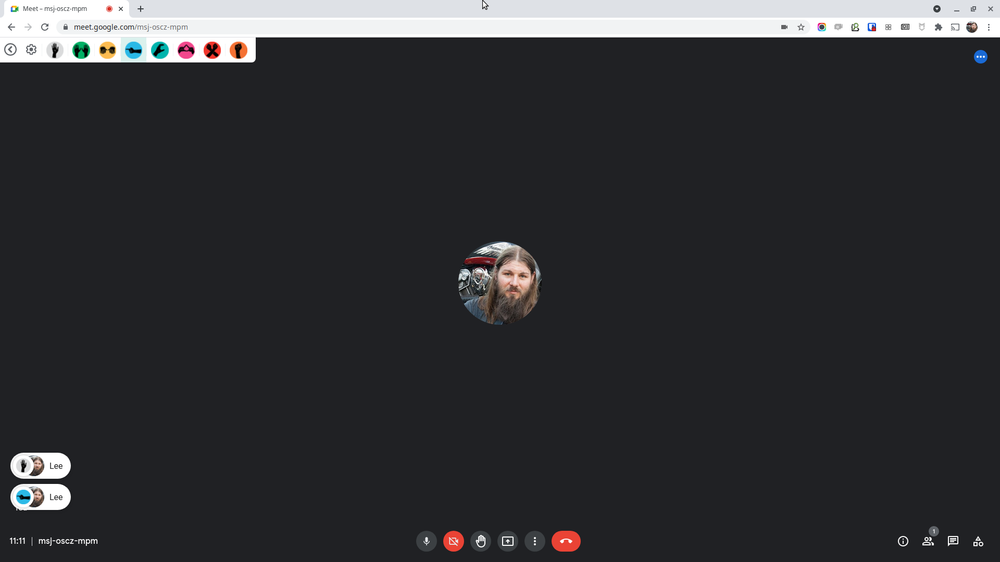
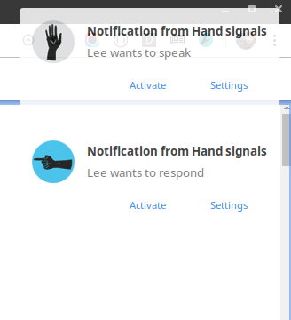
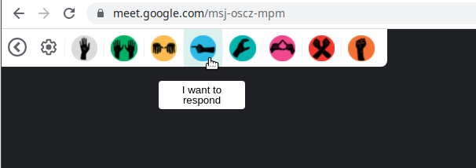

# Notice of decommission

We aim to decommission this extension by the end of 2023.

## Occupy hand signals for Google Meet

Chrome and Firefox extension for Google Meet enabling Occupy hand signals.

---

## Install

[Install from Chrome Store](https://chrome.google.com/webstore/detail/hand-signals-hand-signals/npkagcojnlkccpdcgokfijkbhmlkglnl)

[Install from Mozilla Addons](https://addons.mozilla.org/en-GB/firefox/addon/hand-signals-for-google-meet/)

## Images of the plugin

All the Occupy Hand Signals are available

Unobtrusive when you aren't interacting with it

Overlays the feed from your team on the video call

Get notifications when you're in presenter view

Tooltips to help when you're not sure of the signs

## Description

When running meetings in real life or virtually, it can be hard to gain consensus quickly. Especially if participants don’t have their video on or are muted. This is where the [Occupy Hand signals](https://en.wikipedia.org/wiki/Occupy_movement_hand_signals) come in. 

As a member of GDS PaaS team we have used the [hand signals in person](https://gds.blog.gov.uk/2016/10/07/platform-as-a-service-team-takes-even-handed-approach-to-meetings/) for a long time. However due to Covid-19 and being fully remote this has proven harder to transfer into virtual meetings, often due to network connectivity constraints needing individuals to turn off their cameras.

Hand signals enables us to continue using our team’s method of communication during meetings on Google Meet.

## How to test the extension locally
- checkout branch you want to test
- run `npm install` (on first use)
- run `npm run build`
- Go to chrome://extensions/.
- At the top right, turn on Developer mode.
- Click Load unpacked.
- Find and select the `extension` folder inside the repo folder

## Deploying the websocket

Install serverless with `npm i -g serverless`

cd into the deploy/prod or deploy/dev directory as appropriate and then run

`gds aws re-development -- serverless`

## Contributing

1.  Fork it
2.  Create your feature branch (`git checkout -b my-new-feature`)
3.  Commit your changes (`git commit -am 'Add some feature'`)
4.  Push to the branch (`git push origin my-new-feature`)
5.  Create new Pull Request

## Attributions  

Forked from https://github.com/jamieecarr/nod and adapted to our non revenue generating needs

